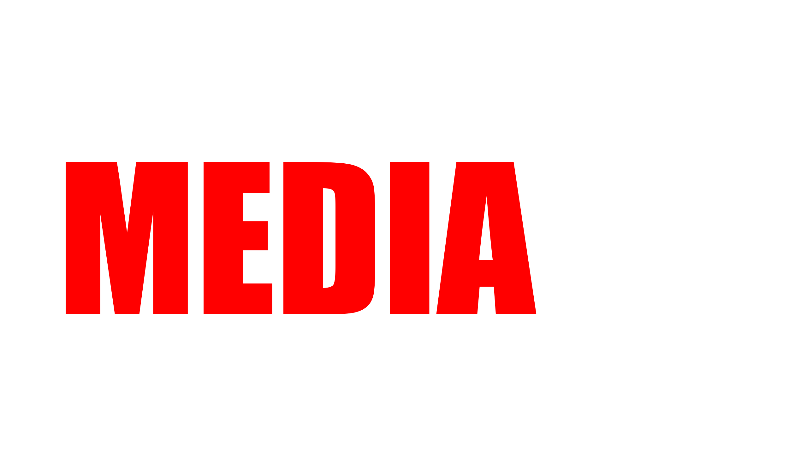

# 🌍 MEDIA243 — La Révolution du Streaming Made in RDC

Bienvenue dans **Media243**, la première plateforme de streaming conçue pour mettre en valeur le talent, la culture et l’excellence audiovisuelle de la République Démocratique du Congo.

Films, séries, musique, documentaires… Tout votre divertissement, réuni dans une expérience fluide, moderne et 100% locale.

---

## 💎 Pourquoi Media243 ?

Parce que l’Afrique centrale mérite une plateforme de streaming qui lui ressemble :

- **Accessible**, même avec une connexion limitée
- **Culturellement riche**, avec un catalogue local fort
- **Moderne**, inspiré des standards Netflix & Spotify
- **Sécurisé** et optimisé grâce à des technologies mondialement reconnues

Media243, c’est **le pont entre la technologie de demain et la créativité congolaise d’aujourd’hui.**

---

## 🎬 Une Expérience de Streaming Pensée pour Vous

### 🎥 Films & Séries

Retrouvez le meilleur du cinéma congolais et international : blockbusters, productions locales, séries exclusives.

### 🎧 Musique & Podcasts

Plongez dans un univers audio riche : artistes congolais, playlists thématiques, interviews, podcasts exclusifs.

### 🎞️ Documentaires

Un regard unique sur la culture, l’histoire, les innovations et les réalités africaines.

---

## 🚀 Une Plateforme Moderne, Efficace & Intelligente

- 🔎 **Recherche intelligente** pour trouver vos contenus en un instant
- 🧠 **Recommandations personnalisées** basées sur votre style
- ⚡ **Lecture optimisée** même sur des réseaux faibles (3G / 4G rural)
- 🌑 **UI immersive façon Netflix**
- 🔐 **Sécurité avancée** : JWT, OAuth, chiffrement des données
- 📱 **Disponible sur tous les appareils**

Votre divertissement, sans limites.

---

## 🏗️ Une Technologie de Classe Mondiale

### Frontend

- Next.js
- ReactJS
- TailwindCSS

### Backend

- Node.js (Express / NestJS)
- MongoDB ou PostgreSQL
- Cloudflare R2 / AWS S3 pour le stockage

### DevOps

- Docker & CI/CD
- Déploiements optimisés (Vercel, AWS, Render)

Une architecture pensée pour la **performance**, la **scalabilité** et la **sécurité**.

---

## 🎯 Notre Vision

Créer l’écosystème numérique le plus puissant d’Afrique centrale en offrant :

- Une vitrine internationale au contenu congolais
- Une plateforme respectueuse des artistes et créateurs
- Une technologie robuste, adaptée aux réalités locales
- Une expérience utilisateur premium

Media243 n’est pas seulement une plateforme…  
**C’est un mouvement.**

---

## 🤝 Rejoignez l’Aventure

Vous êtes développeur, créateur, artiste, producteur ou investisseur ?  
Media243 est ouvert aux collaborations pour écrire l’avenir du streaming en Afrique.

👉 _Créez, partagez, inspirez… Nous nous occupons du reste._

---

## 📬 Contact

**Media243 Team**  
📩 contact@media243.cd  
🌐 Plateforme disponible très bientôt

---
